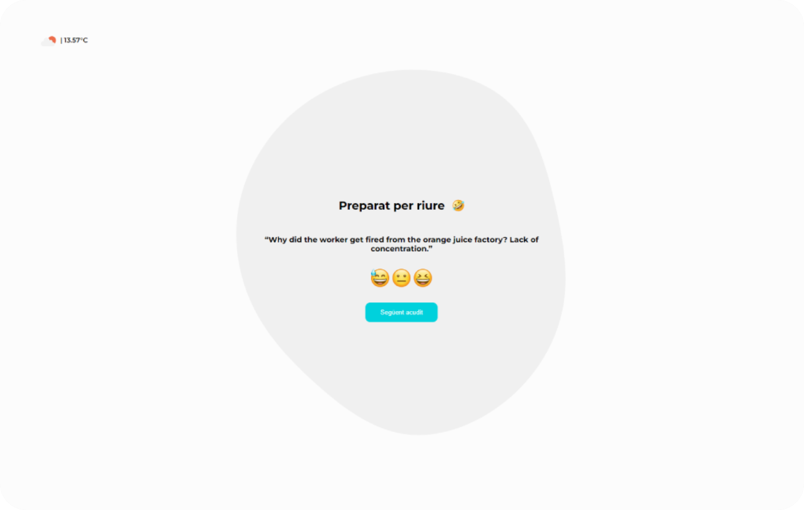

# Sprint 04: API & TypeScript

## Introduction

Embark on an entertaining journey into the world of APIs as we create a delightful joke website, leveraging the humor from two distinct sources: icanhazdadjoke.com and chucknorris.io. This project not only promises laughter but also explores the dynamic integration of data from diverse APIs, showcasing the versatility of web development.

## Description

In this hands-on exercise, we'll dive into the integration of three APIs:

Joke APIs:

- icanhazdadjoke.com: A vast repository of dad jokes for endless amusement.
- chucknorris.io: Unleash the legendary humor of Chuck Norris through this joke API.
- Weather API:

openweathermap.org: Elevate the user experience by incorporating real-time weather and temperature information.

Our application will captivate users with its ability to fetch and display random jokes from both joke APIs, providing them with the unique opportunity to rate each joke. The rated jokes, along with the assigned scores and timestamps, will be systematically stored in an array.

As an additional feature, users will be greeted with up-to-date weather details conveniently positioned in the top-left corner of the website.

This project serves as a kaleidoscope, showcasing the capabilities and adaptability of APIs in software development. By seamlessly blending humor from icanhazdadjoke and chucknorris.io APIs and enabling user interaction through ratings, we've crafted an engaging experience. Furthermore, the integration of the openweathermap API adds a practical touch by offering current weather insights.

## 🌐 Resources

The icanhazdadjoke API was provided by IT Academy Barcelona Activa. The other APIs were found by me, and I have read and followed their respective documentation for correct implementation.

## 🚦 Usage Instructions

To run the project locally, follow these steps:

1. Clone this repository.
2. Run `npm install` to install all dependencies.
3. Run `npm start` to start the server.
4. Open your browser and visit `http://localhost:3000` to see the application in action!

## Knowledge

The development of this project has allowed me to learn about:

- Making requests to external APIs and handling obtained data.
- Manipulating data using JavaScript and TypeScript.
- Creating a dynamic frontend to display real-time data.

## Technologies Used

The Sprint 03: Testing and Validations project leverages the following technologies:

- **JavaScript:** The core language used for implementing and testing array methods.
- **TypeScript:** A JavaScript testing framework for running unit tests on the functions.

## Badges/Shields

Dev Skills

## About Me

I'm a junior frontend developer passionate about creating engaging and functional web applications. This project showcases my skills in HTML, CSS, and JavaScript.

## Contact

If you have any questions or suggestions, do not hesitate to contact me through my email: [codenaud@gmail.com](mailto:codenaud@gmail.com)

Happy coding! 🚀
